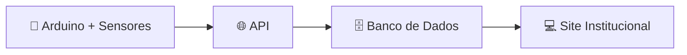

**Monitoramento de temperatura e umidade do ar na maturação de queijos azuis.**

## 🧀 Sobre o projeto

Este projeto tem como objetivo monitorar a umidade e a temperatura de queijos azuis durante o processo de maturação em ambientes controlados. A solução combina hardware (arduino e sensores) e software (APIs, banco de dados e site institucional) para acompanhar essas condições em tempo real.

## 👥 Equipe

| Nome | E-mail |
|---|---|
| Matheus Santos | matheus.dsantos@sptech.school |
| Luann Mariano | luann.mariano@sptech.school |
| Kauã Aguas | kaua.aguas@sptech.school |
| Gregory Casarini | gregory.casarini@sptech.school |
| Guilherme Rosa | guilherme.rosa@sptech.school |
| Igor Pereira | igor.pereira@sptech.school |

