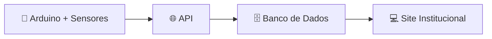

**Monitoramento de temperatura e umidade do ar na maturação de queijos azuis.**

## 🧀 Sobre o projeto

Este projeto tem como objetivo monitorar a umidade e a temperatura de queijos azuis durante o processo de maturação em ambientes controlados. A solução combina hardware (arduino e sensores) e software (APIs, banco de dados e site institucional) para acompanhar essas condições em tempo real.

## 🔗 Links

| Documento | Link |
|---|---|
| Backlog e Tarefas | [Jira](https://igor-fuchs-pereira.atlassian.net/jira/software/projects/BCS) 
| Backlog | [Excel](https://bandteccom-my.sharepoint.com/:x:/g/personal/igor_pereira_sptech_school/IQAb65aOH4v8Q4hLM59xKGtrAftC41Jy3egA0QqcJipNpJA?e=ZaaaNB) |
| Documentação | [Word](https://bandteccom-my.sharepoint.com/:w:/g/personal/igor_pereira_sptech_school/IQCqt9FMeYdbRJukiGQAj8gjAfKs-cL8G7m08feIw0PGads?e=Yv3O12) |
| Site Institucional | [Figma](https://www.figma.com/design/x1H7kIV6jTcIsrpbcfmXkY/Prot%C3%B3tipo-Site-Institucional?t=VjGqwV4s5uzStGkh-1) |
| Tarefas | [Trello](https://trello.com/b/UveA5rzU/1s-blue-cheese-solutions) |
| Slide | [Canva](https://canva.link/xmequv2bsg04uer) |
| Arduino | [Tinkercad](https://www.tinkercad.com/things/bXdLR7ZahWf-1s-blue-cheese-solutions?sharecode=7Iuf28ZjUgrUizOj0Ka3jAzG1GE3slGxypQFNji5TE4) |

## 👥 Equipe

| Nome | E-mail |
|---|---|
| Gregory Casarini | gregory.casarini@sptech.school |
| Guilherme Rosa | guilherme.rosa@sptech.school |
| Igor Pereira | igor.pereira@sptech.school |
| Kauã Aguas | kaua.aguas@sptech.school |
| Luann Mariano | luann.mariano@sptech.school |
| Matheus Santos | matheus.dsantos@sptech.school |

