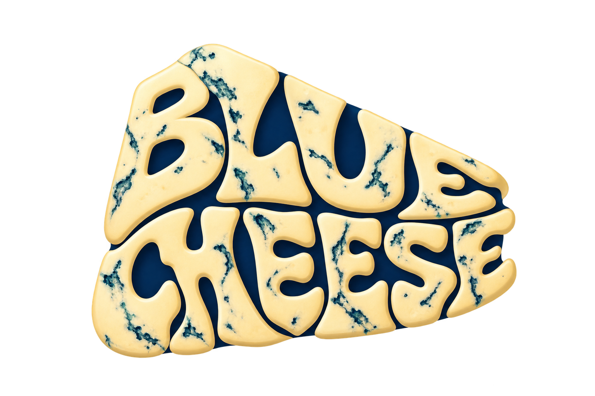
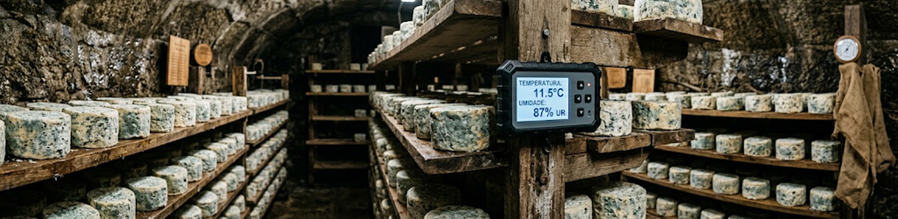
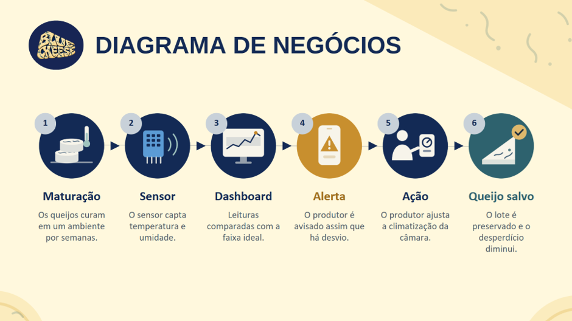

### Monitore o ambiente. *Aperfeiçoe a maturação.*

**Monitoramento de temperatura e umidade do ar na maturação de queijos azuis.**

  

## 🧀 Sobre o projeto

Este projeto tem como objetivo monitorar a umidade e a temperatura de queijos azuis durante o processo de maturação em ambientes controlados. A solução combina hardware (arduino e sensores) e software (APIs, banco de dados e site institucional) para acompanhar essas condições em tempo real.

O projeto nasceu com **3 objetivos**:

| | Objetivo | Descrição |
|:---:|---|---|
| ↯ | **Monitoramento em tempo real** | Acompanhar cada câmara ao vivo e receber alertas antes que qualquer variável saia da faixa ideal. |
| ♨ | **Acompanhamento de temperatura** | Checar a temperatura durante o processo evitando a degradação ou o endurecimento do queijo. |
| ◉ | **Acompanhamento da umidade** | Visualizar a umidade relativa ao longo do tempo e evitar ressecamento ou excesso de mofo. |

## ⚙️ Como funciona

  

## 🔗 Links

| Documento | Link |
|---|---|
| Backlog | [Excel](https://bandteccom-my.sharepoint.com/:x:/g/personal/igor_pereira_sptech_school/IQCYeAtm0fkGRqVhzG7jpZtQAcOZTMoEFPwweehO5mv2s1w?e=xhvkvV) |
| Planilha de Riscos | [Excel](https://bandteccom-my.sharepoint.com/:x:/g/personal/guilherme_rosa_sptech_school/IQCg7UB4xyClRrnbfCy09L_mASW8E9gfAGzkURspt6Sb4SU?e=tempbw) |
| Documentação | [Word](https://bandteccom-my.sharepoint.com/:w:/g/personal/igor_pereira_sptech_school/IQCqt9FMeYdbRJukiGQAj8gjAfKs-cL8G7m08feIw0PGads?e=Yv3O12) |
| Protótipo do Site Institucional | [Figma](https://www.figma.com/design/x1H7kIV6jTcIsrpbcfmXkY/Prot%C3%B3tipo-Site-Institucional?t=VjGqwV4s5uzStGkh-1) |
| Gerenciador de Tarefas | [Trello](https://trello.com/b/UveA5rzU/1s-blue-cheese-solutions) |
| Slide de Apresentação | [Canva](https://canva.link/xmequv2bsg04uer) |
| Arduino | [Tinkercad](https://www.tinkercad.com/things/8F3M1LrF4G5-1s-blue-cheese-solutions?sharecode=fDw5O4h4axVky3vQgS56hJP7YLyChheD-giTP9izQ8A) |

## 👥 Equipe

| Nome | E-mail |
|---|---|
| Gregory Casarini | gregory.casarini@sptech.school |
| Guilherme Rosa | guilherme.rosa@sptech.school |
| Igor Pereira | igor.pereira@sptech.school |
| Kauã Aguas | kaua.aguas@sptech.school |
| Luann Mariano | luann.mariano@sptech.school |
| Matheus Santos | matheus.dsantos@sptech.school |

 

*Precisão que se sente no sabor.*

